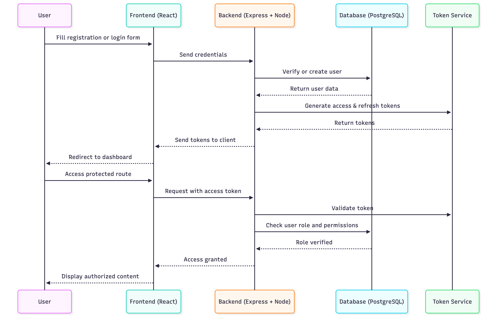

## Authentication and Authorization Flow

The **Authentication and Authorization module** manages secure user access across the Grocery Delivery platform. It ensures that both **buyers** and **sellers** can interact safely with the system based on their assigned roles.

When a new user registers, their details are stored in the database, and a role (buyer or seller) is assigned. During login, credentials are validated, and upon success, the backend issues **JWT access and refresh tokens**, enabling session management without repeated logins.

Once authenticated, users can access **protected routes** depending on their role. Buyers can browse products, add items to their cart, and place orders, while sellers can manage their inventory and add new products. Each request to protected endpoints includes a **token**, which is verified by the backend to confirm identity and authorization.

For sellers, product image uploads are handled securely using **AWS S3 presigned URLs**, ensuring that only authorized users can upload media files. When a user logs out, stored refresh tokens are removed, effectively ending the session.

### This module ensures:
- Secure, token-based authentication and session handling  
- Role-based access control for buyers and sellers  
- Protected media uploads via AWS S3 presigned URLs  
- Smooth and consistent user experience across the platform  

By enforcing authentication and authorization at every interaction, the system maintains **data security, controlled access, and operational integrity** throughout the Grocery Delivery Website.

