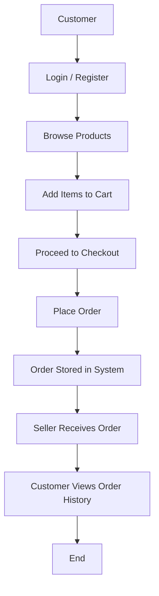

## Introduction

This documentation describes the planned design and functionality of a **FreshNest** that will be developed using the **PERN stack** (PostgreSQL, Express.js, React.js, Node.js) and integrated with **AWS S3** for media and product image storage.

The idea is to build a simple, scalable web platform where:

- **Customers** can browse grocery products, add items to their cart, and place orders online.
- **Sellers** can log in, upload their products, manage product, and handle customer orders through a dedicated dashboard.

---

## Purpose

The primary goal of this project is to **digitize the grocery shopping experience** by creating a platform that connects local sellers directly with customers.  

This system will also serve as a learning-oriented project to implement a full-stack web application from scratch using modern web technologies, including cloud storage.

---

## Scope

This project will cover both **frontend** and **backend** development, with features focused around customers and sellers.  

**Some of the main areas within scope include**:

- A homepage showcasing product.  
- A product search feature.  
- Shopping cart and checkout functionality for customers.  
- Seller-side dashboard for adding or editing products and managing orders.  
- Authentication system using JWT with role-based access.  
- Image storage and retrieval from AWS.  

**Out of scope for the initial version are**:

- Real payment integration.  
- Admin control panel or multi-location delivery tracking.

---

## Proposed Solution

Traditional grocery shopping is limited by location, time, and manual effort. The proposed solution is to create an **online grocery delivery system** where both sellers and customers can interact in one place.

The solution will:

- Provide a clean and responsive user interface using React.   
- Store all persistent data, including users, products, and orders, in PostgreSQL.  
- Use AWS to store product images and serve them efficiently through URLs.  
- Implement authentication and authorization using JSON Web Tokens (JWT).  

The aim is to make the system flexible, secure, and easy to extend with new features later.

---

## Technology Stack

| Layer | Technology | Description |
|:------|:------------|:-------------|
| **Frontend** | React.js | Single-page UI with reusable components and dynamic routing. |
| **Backend** | Node.js + Express.js | API layer handling requests, authentication, and data operations. |
| **Database** | PostgreSQL | Relational database for structured storage of products, users, and orders. |
| **Cloud Storage** | AWS S3 | For image uploads (product photos, banners, etc.). |
| **Authentication** | JWT (JSON Web Token) | Role-based user authentication and route protection. |
| **Styling** | Tailwind | Responsive and clean UI for both desktop and mobile. |
| **Version Control** | Git + GitHub | Code management and collaboration. |

---

## System Flow Overview

The application will have two key roles: **Customer** and **Seller**.  
Below is a simple overview of how each role interacts with the system.

### Customer Flow
1. The user visits the website and browses available groceries.  
2. They can search for specific items or view all products.  
3. After logging in, they add items to the cart and proceed to checkout.  
4. On checkout, the order is stored in the database.  

### Seller Flow
1. The seller logs in via a separate portal or dashboard.  
2. They can add new products with details and upload images.   
3. New orders appear in their dashboard for review and processing.  

This structure ensures both parties have a smooth and role-specific experience.
---

## Overall System Flow

The following flowchart shows the high-level process of the Grocery Delivery Website.  
It represents the main steps involved in both Customer and Seller interactions with the system.

---

## Key Functionalities

### 1. Authentication
- Login, register, and logout functionality for both roles.
- JWT-based session handling and role verification.
- Basic validation for inputs and user credentials.

### 2. Product Management (Seller)
- Product data stored in PostgreSQL, with images uploaded to AWS.

### 3. Product Search (Customer)
- Customers can browse products.

### 4. Shopping Cart & Checkout
- Add/remove items and update quantity in the cart.
- Order summary generated at checkout.

### 5. Orders & Dashboard
- Sellers can see customer orders.
- Customers can view their active and past orders.
- Both dashboards will show essential information based on the logged-in role.

---

## Security Features

Security will be implemented through:

- **JWT authentication** to verify and protect all private routes.  
- **Password hashing** using bcrypt before storing user credentials.

The goal is to ensure user and product data remain safe throughout all operations.

---

## Expected Outcome

After development, the system should:

- Provide an efficient and user-friendly grocery shopping experience.  
- Offer a structured product and order management dashboard for sellers.  
- Ensure data security and reliability using PostgreSQL and AWS.   
- Demonstrate strong understanding and application of the PERN stack.

This project is expected to serve as both a functional prototype and a strong learning example for full-stack development with cloud integration.

---

## Future Enhancements

Once the core system is stable, additional features could be added:

- Payment gateway integration (Stripe, Razorpay).  
- Email notifications for order confirmation or shipment.  
- Real-time delivery tracking.  

These can be implemented incrementally without major architectural changes.

---

## Conclusion

This Functional Documentation presents the proposed plan for building  **FreshNest** using the **PERN stack and AWS**.  
The system will streamline grocery shopping by giving customers an online platform and sellers a smart management dashboard.  

By focusing on cloud integration, responsive UI, and secure architecture, the project aims to create a practical, scalable solution that can evolve into a complete e-commerce application in the future.  
This document serves as the foundation for the development phase, outlining how each part of the system will come together.
