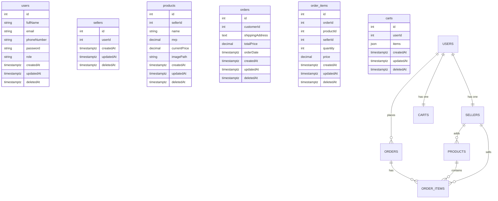

---
<!-- 
## Indexing Table 

| Table Name      | Indexed Column(s)           | Reason for Indexing                                           | Use Case                                                 |
| --------------- | --------------------------- | ------------------------------------------------------------- | -------------------------------------------------------- |
| **users**       | `email` (UNIQUE)            | Fast lookups + enforce unique login identity.                 | Login / auth, checking duplicate emails.                 |
| **users**       | `id` (PK, default index)    | Main reference for relations (sellers, carts, orders).        | Joining users with related tables.                       |
| **sellers**     | `userId`                    | Quickly find seller record for a given user.                  | Load seller dashboard right after auth.                  |
| **products**    | `sellerId`                  | Efficiently list all products of a seller.                    | Seller’s “My Products” page.                             |
| **products**    | `name` (B-tree or trigram)  | Speed up product search by name / keyword.                    | Buyer search bar for grocery items.                      |
| **carts**       | `userId`                    | Fetch the active cart for a user quickly.                     | Show cart when user opens cart page.                     |
| **orders**      | `customerId`                | Retrieve all orders belonging to a user.                      | Order history in customer dashboard.                     |
| **orders**      | (`customerId`, `createdAt`) | Filter/sort orders by date per customer efficiently.          | “Recent orders” view.                                    |
| **order_items** | `orderId`                   | Quickly fetch all items for an order.                         | Show items inside an order detail page.                  |
| **order_items** | (`orderId`, `productId`)    | Avoid duplicates and speed joins between orders and products. | Reporting, checking if a product is in a specific order. |
| **order_items** | `sellerId`                  | Query all order items sold by a particular seller.            | Seller’s sales analytics / order list.                   | -->