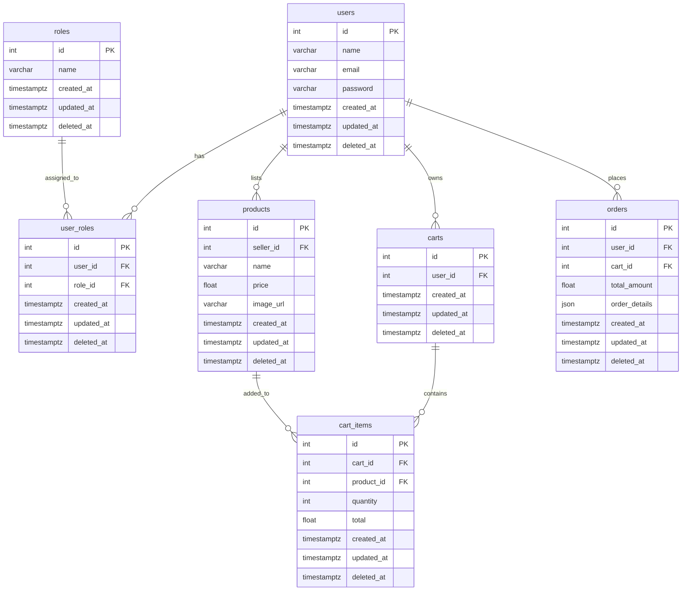

---
## Indexing Table

| Table Name | Indexed Column(s) | Reason for Indexing | Use Case |
|-------------|-------------------|---------------------|-----------|
| **users** | `email` | Ensures unique email entries and speeds up login validation. | Quickly authenticate user during login. |
| **users** | `id` | Primary identifier for users in the system. | Fetch user data during role or order queries. |
| **roles** | `name` | Guarantees unique role names for system-level role management. | Assign correct role (Buyer or Seller) during registration. |
| **user_roles** | `(user_id, role_id)` (Composite) | Prevents duplicate role assignments for a single user. | Manage and verify user’s assigned roles efficiently. |
| **products** | `seller_id` | Enables fast lookup of all products by a seller. | Display seller’s product list in their dashboard. |
| **products** | `name` | Improves search performance across product listings. | Quickly search for grocery items by name or keyword. |
| **carts** | `user_id` | Allows quick retrieval of a user’s active cart. | Load user’s cart instantly after login. |
| **cart_items** | `(cart_id, product_id)` (Composite) | Ensures each product appears only once per cart and speeds joins. | Fetch all items for a specific cart efficiently. |
| **orders** | `user_id` | Facilitates quick retrieval of order history for each user. | Display user’s order list in order history. |
| **orders** | `(user_id, created_at)` (Composite) | Optimizes order tracking and recent order queries. | Sort and filter user orders by date quickly. |

---