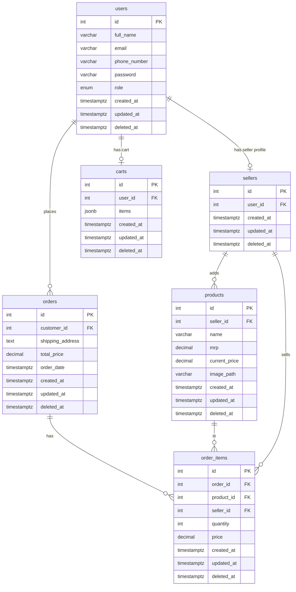

```mermaid
erDiagram

    users {
        int id PK
        varchar full_name
        varchar email
        varchar phone_number
        varchar password
        enum role
        timestamptz created_at
        timestamptz updated_at
        timestamptz deleted_at
    }

    sellers {
        int id PK
        int user_id FK
        timestamptz created_at
        timestamptz updated_at
        timestamptz deleted_at
    }

    products {
        int id PK
        int seller_id FK
        varchar name
        decimal mrp
        decimal current_price
        varchar image_path
        timestamptz created_at
        timestamptz updated_at
        timestamptz deleted_at
    }

    orders {
        int id PK
        int customer_id FK
        text shipping_address
        decimal total_price
        timestamptz order_date
        timestamptz created_at
        timestamptz updated_at
        timestamptz deleted_at
    }

    order_items {
        int id PK
        int order_id FK
        int product_id FK
        int seller_id FK
        int quantity
        decimal price
        timestamptz created_at
        timestamptz updated_at
        timestamptz deleted_at
    }

    carts {
        int id PK
        int user_id FK
        jsonb items
        timestamptz created_at
        timestamptz updated_at
        timestamptz deleted_at
    }

    users   ||--o| sellers     : "has seller profile"
    users   ||--o| carts       : "has cart"

    sellers ||--o{ products    : "adds"
    users   ||--o{ orders      : "places"
    orders  ||--o{ order_items : "has"
    products||--o{ order_items : "in"
    sellers ||--o{ order_items : "sells"

```
---